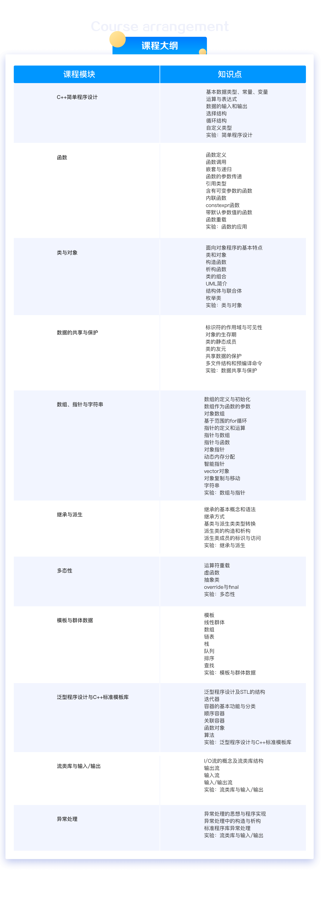

# cpp_demo

## Refactor

## XuetangX Cpp

### syllabus

| chapter | demo | description |  
| --- | --- | --- | 
|ch6|[ch6_2_arrarAsFuncParam.cpp](XuetangX/ch6/ch6_2_arrarAsFuncParam.cpp)|数组作为函数的参数|  
|ch6|[ch6_3_array_of_obj.cpp](XuetangX/ch6/ch6_3_array_of_obj.cpp)|对象数组|  
|ch6|[ch6_4_range_based_for.cpp](XuetangX/ch6/ch6_4_range_based_for.cpp)|基于范围的for循环|  
|ch6|[ch6_5_ptr_basic.cpp](XuetangX/ch6/ch6_5_ptr_basic.cpp)|指针的初始化和赋值|  
|ch6|[ch6_5_void_ptr.cpp](XuetangX/ch6/ch6_5_void_ptr.cpp)|void指针|  
|ch6|[ch6_5_const_and_pointer.cpp](XuetangX/ch6/ch6_5_const_and_pointer.cpp)|const和指针|  
|ch6|[ch6_6_array_of_pointer.cpp](XuetangX/ch6/ch6_6_array_of_pointer.cpp)|指针数组|  
|ch6|[ch6_7_pointer_to_function.cpp](XuetangX/ch6/ch6_7_pointer_to_function.cpp)|函数指针|  
|ch6|[ch6_9_dynamic_memory.cpp](XuetangX/ch6/ch6_9_dynamic_memory.cpp)|动态内存的申请和释放|  
|ch6|[ch6_9_class_of_dynArr.cpp](XuetangX/ch6/ch6_9_class_of_dynArr.cpp)|动态数组类|  
|ch6|[ch6_12_shallow_copy.cpp](XuetangX/ch6/ch6_12_shallow_copy.cpp)|浅拷贝|  
|ch6|[ch6_12_deep_copy.cpp](XuetangX/ch6/ch6_12_deep_copy.cpp)|深拷贝|  
|ch6|[ch6_12_move_constuct.cpp](XuetangX/ch6/ch6_12_move_construct.cpp)|移动构造|  
|ch6|[ch6_13_string.cpp](XuetangX/ch6/ch6_13_string.cpp)|字符串和string|  
|ch7|[ch7_2_public_derive.cpp](XuetangX/ch7/ch7_2_public_derive.cpp)|公有继承|  
|ch7|[ch7_2_private_derive.cpp](XuetangX/ch7/ch7_2_private_derive.cpp)|私有继承|  
|ch7|[ch7_2_protected_derive.cpp](XuetangX/ch7/ch7_2_protected_derive.cpp)|保护继承|  
|ch7|[ch7_2_multi_derive.cpp](XuetangX/ch7/ch7_2_multi_derive.cpp)|多继承|  
|ch7|[ch7_3_type_cast.cpp](XuetangX/ch7/ch7_3_type_cast.cpp)|基类和派生类的类型转换|  
|ch7|[ch7_4_singleInherit_deriveConstructor.cpp](XuetangX/ch7/ch7_4_singleInherit_deriveConstructor.cpp)|单继承派生类构造函数|  
|ch7|[ch7_4_multiInherit_deriveConstructor.cpp](XuetangX/ch7/ch7_4_multiInherit_deriveConstructor.cpp)|多继承派生类构造函数|  
|ch7|[ch7_4_deriveDestructor.cpp](XuetangX/ch7/ch7_4_deriveDestructor.cpp)|派生类的析构函数|  
|ch7|[ch7_5_visit_member_from_base.cpp](XuetangX/ch7/ch7_5_visit_member_from_base.cpp)|访问基类成员|  
|ch7|[ch7_5_virtual_base_class.cpp](XuetangX/ch7/ch7_5_virtual_base_class.cpp)|虚继承|  
|ch8|[ch8_1_mono_op.cpp](XuetangX/ch8/ch8_1_mono_op.cpp)|一元运算符的重载|  
|ch8|[ch8_1_bino_op.cpp](XuetangX/ch8/ch8_1_bino_op.cpp)|二元运算符的重载|  
|ch8|[ch8_1_nonObjFunc.cpp](XuetangX/ch8/ch8_1_nonObjFunc.cpp)|重载为非成员函数|  
|ch8|[ch8_2_virtual_func.cpp](XuetangX/ch8/ch8_2_virtual_func.cpp)|虚函数|  
|ch8|[ch8_2_virtual_destructor.cpp](XuetangX/ch8/ch8_2_virtual_destructor.cpp)|虚析构函数|  
|ch8|[ch8_3_abstract_class.cpp](XuetangX/ch8/ch8_3_abstract_class.cpp)|抽象类| 
|ch8|[ch8_4_override.cpp](XuetangX/ch8/ch8_4_override.cpp)|override显示覆盖基类的成员函数| 
|ch8|[ch8_4_final.cpp](XuetangX/ch8/ch8_4_final.cpp)|final不允许基类或基类成员函数被覆盖| 

### Link
0x01: [C++语言程序设计基础(自主模式)](http://www.xuetangx.com/courses/course-v1:TsinghuaX+00740043X_2015_T2+sp/about)  
0x02: [C++语言程序设计进阶(自主模式)](http://www.xuetangx.com/courses/course-v1:TsinghuaX+00740043_2x_2015_T2+sp/about)  